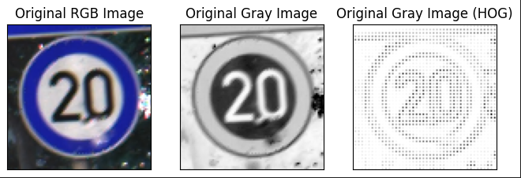
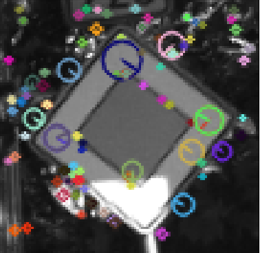
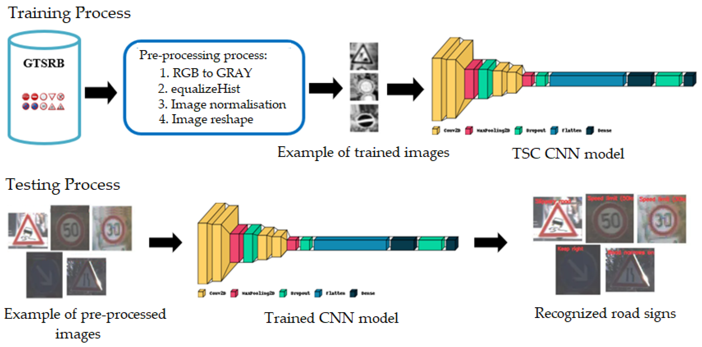
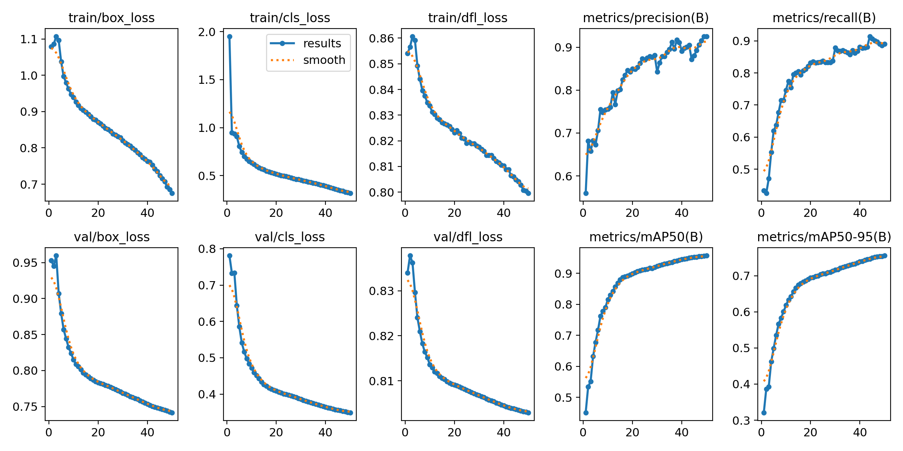
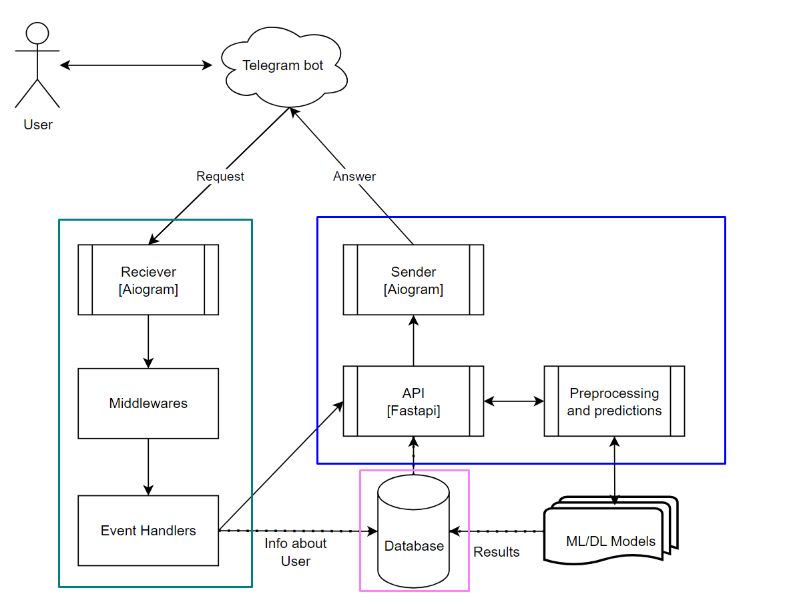

# Детекция и классификация дорожных знаков
Проект посвящен созданию сервиса детекции и классификации дорожных знаков. 

https://github.com/gbull25/signs-classification/assets/79256016/39836018-8c9c-4ef0-863f-c4637175512a


У проекта имеется несколько этапов развития. Подробно о них можно почитать ниже.

В качестве обучающего датасета взят каноничный в этой области [GTSRB](https://www.kaggle.com/datasets/meowmeowmeowmeowmeow/gtsrb-german-traffic-sign).
Позднее было принято решение о переключении на датасет [RTSD](https://graphics.cs.msu.ru/projects/traffic-sign-recognition.html). 

Ссылки на Docker Hub:
- [Телеграм бот](https://hub.docker.com/repository/docker/gbull25/tg_bot/general)
- [Фастапи сервис](https://hub.docker.com/repository/docker/gbull25/sign_classifier/general)

# Процесс запуска сервиса

В данной ветке, в отличие от остальных, присутствует скрытый файл .env с переменными окружения для БД и Redis.

Процесс запуска проекта:

1. Склонировать репозиторий 
2.(Опционально) Если вы планируете использовать Telegram бота: создать бота, положить .env файл с заполенной переменной окружения BOT_TOKEN в директорию signs_classification/services/tg_bot
3. Перейти в директорию signs_classification/services
4. Выполнить команду **docker-compose build**, а затем **docker compose up**

Вы можете написать нам [Глеб](https://t.me/jdbelg) или [Витя](https://t.me/onthebox) в телеграме, мы с удовольствием ответим на ваши вопросы по проекту.

Схема репозитория
------------
```
   .
   ├── jupyter                      <- main .ipynb files
   │   ├── CNN_exp.ipynb
   │   ├── EDA.ipynb
   │   ├── CNN_transfer.ipynb
   │   ├── rtsd-yolo-test.ipynb
   │   ├── HOG.ipynb
   │   └── SIFT.ipynb
   ├── LICENSE
   ├── readme_data
   │   ├── fastapi.gif
   │   └── tg_bot.gif
   ├── README.md
   ├── requirements.txt
   ├── services
   │   ├── docker-compose.yaml      <- main docker compose
   │   ├── sign_classifier
   │   │   ├── dockerfile
   │   │   ├── docker.sh
   │   │   ├── requirements.txt
   │   │   ├── app                  <- FastAPI service main dir
   │   │   │   ├── alembic.ini
   │   │   │   ├── cnn_model.py
   │   │   │   ├── cropped_sign.py
   │   │   │   ├── log_conf.yaml
   │   │   │   ├── main.py
   │   │   │   ├── model_loader.py
   │   │   │   ├── numbers_to_classes.csv
   │   │   │   ├── settings.py
   │   │   │   ├── sign_detection.py
   │   │   │   ├── utils.py
   │   │   ├───auth                 <- FastAPI service auth module
   │   │   │   ├── .env
   │   │   │   ├── base_config.py
   │   │   │   ├── config.py
   │   │   │   ├── database.py
   │   │   │   ├── manager.py
   │   │   │   ├── models.py
   │   │   │   ├── router.py
   │   │   │   ├── schemas.py
   │   │   │   ├── utils.py
   │   │   │
   │   │   ├───migrations           <- Alembic migrations
   │   │   │   └── versions
   │   │   ├───pages                <- Some http files
   │   │   │   ├── router.py
   │   │   │   ├── static
   │   │   │   └── templates
   │   │   ├───rating               <- FastAPI service rating module
   │   │   │   ├──  router.py
   │   │   │   └─── schemas.py
   │   │   └───models               <- DL models
   │   │       ├──cnn_rtsd_final.pt
   │   │       ├──cnn_torch.pt
   │   │       └──yolo_best_50epochs.pt
   │   │
   │   └── tg_bot                   <- Telegram bot service
   │       ├── bot.py
   │       ├── config_reader.py
   │       ├── dockerfile
   │       ├── handlers             <- event handlers
   │       │   ├── menu.py
   │       │   ├── predictions.py
   │       │   └── rating.csv
   │       ├── middleware.py        <- middleware fucntions
   │       ├── requirements.txt
   │       ├── sample_videos        <- directory with sample videos for bot
   │       ├── sample_images        <- directory with sample images for bot
   │       └── tests                <- unit tests for telegram bot
   │           ├── htmlcov          <- directory with html coverage report
   │           └── test_handlers.py
   ├── setup.cfg
   └── setup.py
```


## Задачи проекта
- Создание и обучение ML модели классификации дорожных знаков.​
- Реализация FastAPI сервиса и создание Telegram бота.​
- Создание и обучение модели для детекции дорожных знаков.​
- Объединение двух моделей в пайплайн обработки фотографии (на которой ожидается дорожный знак).​
- Добавление возможности работы с видео и ссылкой на YouTube.​
- !Амбициозно! Реализация сервиса хранения и визуализации информации о найденных дорожных знаках (база данных со знаками, визуализация на картах).​
- !Амбициозно! Демо-вариант с обработкой панорам с каких-нибудь онлайн-карт.

## Этап 1: ML подход

Первостепенной задачей в стремелении обучить ML-модель классифицировать изображения является попытка найти читаемые моделью признаки на входящих фотографиях. Существует множество разных алгоритмов экстракции признаков из изображений, среди них мы решили протестировать следующие два - это [HOG](https://scikit-image.org/docs/stable/auto_examples/features_detection/plot_hog.html) и [SIFT](https://docs.opencv.org/4.x/da/df5/tutorial_py_sift_intro.html). Целевой моделью для обучения на полученных признаках была выбрана [SVM](https://scikit-learn.org/stable/modules/svm.html). 

Подробнее о методе их работы вы можете прочитать по ссылке, или ознакомиться в соответствующих ноутбуках с исследованиями в папке jupyter.

### HOG + SVM



Пример результата работы HOG.

Предварительно изображения переводятся в черно-белые и ресайзятся до размера 50x50. Далее из изображения извлекались HOG дескрипторы в виде векторов, которые в конечном итоге и формировали матрицу объект-признак. На этой матрице обучался SVM-классификатор, который и стал результирующей моделью, представляющей HOG метод в этой работе.

Тестировались разнообразные параметры экстракции признаков и предварительной обработки изображений, лучшие метрики на тестовой выборке получились следующими:

|              | precision | recall   | f1-score | support |
| ------------ | --------- | -------- | -------- | ------- |
| accuracy     |           |          | 0.61     | 12630   |
| macro avg    | 0.57      |  0.57    | 0.55     | 12630   |
| weighted avg | 0.64      |  0.61    | 0.61     | 12630   |

### SIFT + Bag-Of-Visual-Words + SVM



Пример результата работы SIFT.

Предварительно изображения проходили следующую обработку: выравнивание гистограммы, нормализация, переводились в черно-белые и ресайзились до размера 32x32. Далее при помощи алгоритма SIFT для всех изображений из тестовой выборки извлекались дескрипторы (каждый дескриптор - вектор размерностью 128, их может быть как несколько у одного изображения, так и не быть вообще). Затем куча получившихся дексрипторов кластеризировалась с помощью алгоритма KMeans. 

Финальный шаг - снова достать дескрипторы из каждого изображения и найти ближайший центр кластера для каждого, затем инициализировать нулевой вектор произвольной размерности (в нашем случае размерность 43 класса * 15), в котором каждый j-ый элемент увеличивался на 1, где j - индекс найденного центра кластера. Получившийся вектор и есть вектор признаков, из которых формировалсь матрица объект-признак. SVM-классификатор, который и стал результирующей моделью, представляющей SIFT метод в этой работе.

Тестировались разнообразные параметры экстракции признаков и предварительной обработки изображений, лучшие метрики на тестовой выборке получились следующими:

|              | precision | recall   | f1-score | support |
| ------------ | --------- | -------- | -------- | ------- |
| accuracy     |           |          | 0.73     | 12630   |
| macro avg    | 0.76      |  0.63    | 0.66     | 12630   |
| weighted avg | 0.74      |  0.73    | 0.72     | 12630   |

### Вывод 1 этапа

Модель, обученая с использованием SIFT'a и мешка слов, судя по метрикам, показала себя несколько лучше. Однако на деле обе модели ошибаются довольно часто и не являются надежными. Желаемого качества предсказаний не удалось достичь, используя линейные модели в ML-подходе.


## Этап 2: Convolutional neural network



Пример архитектуры модели CNN.

Предварительно изображения из тренировочной выборки проходили следующую обработку: случайное выравнивание гистограммы, настройка яркости и контрастности, случайные повороты и отражения изображений (вертикальные и горзинотальные), случайное размытие Гаусса, ресайзились до размера 50x50, переводились в тензорный вид. Далее создается сверточная нейросеть, объявляемая через отельный класс с помощью библиотеки Pytorch. Она состоит из слоя Flatten, слоев Dropout, слоя с активацией ReLU, MaxPooling2D, трех наборов слоев Conv2D с увеличивающимся количеством фильтров вместе с BatchNorm2d и, наконец, Linear слоями.

Тестировались разные варианты слоев сетки, а также менялись гиперпараметры, лучшие метрики на тестовой выборке получились следующими:

|              | precision | recall   | f1-score | support |
| ------------ | --------- | -------- | -------- | ------- |
| accuracy     |           |          | 0.99     | 12630   |
| macro avg    | 0.99      |  0.99    | 0.99     | 12630   |
| weighted avg | 0.99      |  0.99    | 0.99     | 12630   |


### Вывод 2 этапа

Сверточная нейросеть показала крайне высокое качество, как и ожидалось от state-of-the-art решения задачи классификации датасета GTSRB. Данные результаты работы классификаторы мы приннимаем достаточными для инференса. Оставшееся время до чекпоинта мы потратили на упаковку сервисов в контейнеры и оформление репозитория.


## Этап 3: Переезд на RTSD, YOLO, Transfer Learning CNN

### Про датасет RTSD

На заключительном этапе проекта мы решили, что успеваем добавить к проекту задачу детекции. 

Поскольку датасет GTSRB не подходит для обучения детектора, а его соседский датасет для задач детекции GTSDB очень маленький (900 картинок), было принято решение перейти на датасет с российскими дорожными знаками RTSD.  

Кадры в RTSD получены с видеорегистратора, разрешение кадров от 1280×720 до 1920×1080. Кадры сняты в разные сезоны (весна, осень, зима), время суток (утро, день, вечер) и при разных погодных условиях (дождь, снег, яркое солнце). Этот набор данных превосходит другие общедоступные наборы данных дорожных знаков по количеству кадров, классов знаков, физических знаков и изображений знаков. 
Он состоит из 205 классов, из которых 99 встречаются только в тестовом наборе и полностью отсутствуют в обучающем наборе, а 106 классов присутствуют в обучающем наборе.

Датасет RTSD разделен на несколько частей: для задач детекции и классификации в нем есть несколько подвыборок для разных случаев и применений. Также отличается распределение классов в этих выборках.
Подробнее про датасет можно почитать в ноутбуке CNN_transfer.py.


### Transfer learning CNN

Подробно об этом этапе можно почитать в ноутбуке CNN_transfer.py

Чтобы научить нашу готовую сверточную нейросеть предсказывать на новых данных, было принято решение провести процедуру Transfer learning. 

На практике это представляет из себя следующее: подгружается обученная на старом датасете модель, размерность последнего линейного слоя модели меняется под новое количество классов, затем модель обучается на новых данных.

Таким образом мы получаем качество выше, чем если бы обучали новую модель с нуля, так как используем веса, полученные на предыдущем цикле обучения. 


Лучшие метрики на тестовой выборке получились следующими:

|              | precision | recall   | f1-score | support |
| ------------ | --------- | -------- | -------- | ------- |
| accuracy     |           |          | 0.95     | 30518   |
| macro avg    | 0.84      |  0.83    | 0.82     | 30518   |
| weighted avg | 0.95      |  0.95    | 0.95     | 30518   |

Метрики получаются не такие хорошие, как при работе с GTSRB, поскольку мы не работали с редкими знаками и балансом классов в RTSD. Эта задача решалась [тут](https://nnov.hse.ru/data/2020/11/27/1350942798/rare-tsr_compressed.pdf) и [тут](https://graphics.cs.msu.ru/projects/traffic-sign-recognition.html). 


### YOLO


Пример архитектуры YOLOv8.

Для задачи детекции использовалась YOLOv8 из библиотеки ultralytics. Подробности обучения модели можно увидеть в ноутбуке rtsd-yolo-test.ipynb. 

Результаты обучения на тестовой выборке после 50 эпох:

|              | precision | recall   | mAP50    | mAP50-95| box_loss | cls_loss| dfl_loss|
| ------------ | --------- | -------- | -------- | ------- | -------  |  -------| ------- |
| value        | 0.9252    |  0.88975 | 0.95721  | 0.7559  | 0.74155  |  0.3493 | 0.80295 | 



### Вывод 3 этапа

Сверточная нейросеть после дообучения на новых данных показала высокое качество. 

Дополнив пайплайн задачей детекцией, нам пришлось довольно много всего переделать в структуре сервисов и в логике проекта. 

Теперь на вход сервису могут приходить не только обрезанные фотографии знаков, но и обычные фотографии с улиц, видео, а также ссылки на YouTube. На выход мы выдаем не только файл с аннотацией, но и отчет по детекции и классификации в виде CSV файла.

В таком виде сервис сильнее приближен к продуктовому решению, которое мы закладывали в этот проект.


## API, tg bot

Взаимодействие с полученными моделями реализовано двумя способами: веб-интерфейс FastAPI и Телеграм бот. 

На данный момент оба модуля упакованы в два докер контейнера. Телеграм бот отвечает на запросы пользователя, используя функционал сервиса FastAPI.



Ниже на гифках краткая демонстрация функционала веб-интерфейса и Телеграм бота.

Веб-интерфейс FastAPI


Телеграм бот


## Планы по развитию проекта

- Добавление GAN при обучении CNN и YOLO на датасете RTSD для симуляции редко встречающихся знаков​.

### Куратор

| Имя | Телеграм | 
|----------|----------|
| Беляев Артем | @karaoke_tutu |


### Авторы проекта

| Имя | Телеграм | 
|----------|----------|
| Булыгин Глеб  | @jdbelg |
| Тихомиров Витя | @onthebox |
